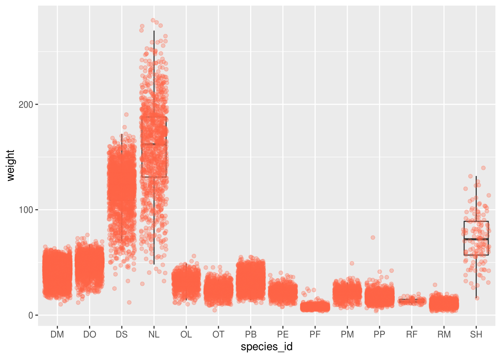

```{r setup, include=FALSE}
knitr::opts_chunk$set(echo = TRUE)
```

## Motivation: What's going on in this graph? 

- Click on the link to the New York Times graph below. 

https://www.nytimes.com/2019/02/07/learning/whats-going-on-in-this-graph-feb-13-2019.html  

- Answer the following questions. The questions are intended to build on one 
another, so try to answer them in order!   

__1. What do you notice?__  

__2. What do you wonder?__  

__3. What are you curious about that comes from what you notice in the graph?__  

__4. Write a catchy headline that captures the graph’s main idea. If your headline makes a claim, tell us what you noticed that supports your claim.__ 


## Data for Today's Lab  

The SIPRI (Stockholm International Peace Research Institute) Military Expenditure
Database is an open source dataset with contains consistent time series on the 
military spending of countries for the period 1949–2018. The database is updated
annually, which may include updates to data for any of the years included in the
database.

Military expenditure in local currency at current prices is presented according
to both the financial year of each country and according to calendar year, 
calculated on the assumption that, where financial years do not correspond to 
calendar years, spending is distributed evenly through the year. 
Figures in constant (2017) and current US $, as a share of GDP and per capita 
are presented according to calendar year. 

The availability of data varies considerably by country, but for a majority of 
countries that were independent at the time, data is available from at least the
late 1950s. Estimates for regional military expenditure have been extended 
backwards depending on availability of data for countries in the region, but no 
estimates for total world military expenditure are available before 1988 due to 
the lack of data for the Soviet Union.

SIPRI military expenditure data is based on open sources only.

</br>
</br>


__5. Use the code below to load the data into your work space and inspect it to answer the following questions:__   

* __How many observations (rows) do the data have? How many variables (columns) 
do the data have?__ 
<!-- Your answer here!  -->


* __Last week the variables that contained numbers were coded as doubles/numeric. 
Why do you believe all of the variables are coded as characters?__ 
<!-- Your answer here!  -->


```{r, message = FALSE}
# The dataset is an excel file, so we need to use the read_xlsx function 
# which lives in the readxl package

library(readxl) # loading in readxl package
library(tidyverse) # loading in tidyverse package 
# contains dpylr, tidyr, and ggplot

military <- read_xlsx("data/gov_spending_per_capita.xlsx")

glimpse(military)

```

</br>
</br>

__6. What are the four ways that missing or unavailable values were coded in this dataset?__ 
<!-- Your answer here!  -->


</br>
</br>

Let's recode all of these missing values into NA responses.  

```{r, warning = FALSE}
military_clean <- military %>% 
                    select(-Country, -Notes) %>% 
                    # removes the Country and Notes variables from the dataset 
                    mutate_if(is.character, as.numeric) %>% 
                    # changes the variables that are characters to numeric  
                    mutate(Country = military$Country) %>% 
                    # adds the Country variable back in  
                    select(Country, everything())
                    # reorders the variables so Country is first 
```

</br>
</br>
</br>


__7. Now, write two questions you group is interested in answering with these data?__

* __Question 1:__   


* __Question 2:__ 


</br>
</br>

A few questions that the NY Times graph stirred up for me were: 

* How has the distribution of military spending has looked across the years?  

* Has the US' military expenditures always been at the top of the world?  


## Data Organization

The comparison I am interested in looking at the military expenditures of 
different countries across every year in the data. Something like this:  




Unfortunately for me, this requires that each year is it's own column! A common 
problem is a dataset where some of the column names are not names of variables, 
but values of a variable. Take the military spending data: the column names 1988, 
1989, 1900, etc. represent values of the year variable, and each row represents
32 observations, not one! 


Generally, we will consider data to be "tidy" if they follow three basic rules:  
1. Each variable has its own column.  
2. Each observation has its own row.  
3. Each value has its own cell.  


## Wide to Long Using `tidyr`  

To tidy a dataset like this, we need to gather those columns into a new pair of
variables. To do this process we need three parameters:  

* The set of columns that represent values, not variables. In these data, those
are all the columns from 1988 to 2018.  

* The name of the variable whose values form the column names. This is called 
the *key*, and for these data it is `year`.  

* The name of the variable whose values are spread over the cells. This I call 
the *value*, and for these data it's the `spending`. 

All of these pieces together form the arguments to the `gather()` function. 


```{r}
long_data <- military_clean %>%  
              gather(-Country, key = "year", value = "spending")

```

__8. Inspect the gathered dataset! What does it look like? Does it look like what you were expecting?__  
<!-- Your answer here!  -->


</br>
</br>


## Data Visualization  

Now that we've transformed the data, let's create a plot to explore the military 
spending across the years.   

```{r, warning = FALSE}

long_data %>% 
  ggplot(aes(y = spending, x = year)) + 
  # add boxplots
  geom_boxplot() + 
  # adds points on top of the boxplots
  geom_jitter(alpha = 0.2, 
              # alpha changes how transparent a poing is (closer to 1 = darker)
              color = "tomato")
  
```

</br>
</br>


Well, that looks pretty overwhelming. If we're set on having every year plotted, 
we have a few options. 

1. We can use the `coord_flip()` option to change the orientation of the plot.  
2. We can play around with the x-axis labels so they look nicer.   

Here is how you would do each:  

```{r, warning = FALSE, results = 'hold'}
long_data %>% 
  ggplot(aes(y = spending, x = year)) + 
  geom_boxplot() + 
  geom_jitter(alpha = 0.2, color = "tomato") +
  coord_flip() # flips the coordinates (y to x, x to y)  


long_data %>% 
  ggplot(aes(y = spending, x = year)) + 
  geom_boxplot() + 
  geom_jitter(alpha = 0.2, color = "tomato") +
  theme(axis.text.x = element_text(angle = 60, hjust = 1))
  # changes the orientation of the x-axis text:
  # angle rotates the text (reative to the axis) 
  # hjust places the label above/below the axis tick (0 = above, 1 = below)  

```

</br>
</br>


__9. Choose the plotting option you like the most and included the plot here.__ 
__Add the following to your plot:__ 
* A better y-axis label (with units)  
* A title to the plot  

Having trouble adding these? Look at the code from Lab 2! 

```{r}
# Your plot here

```


## References  

[R for Data Science - Tidy Data](https://r4ds.had.co.nz/tidy-data.html)  

[R for Data Science - Data Transform](https://r4ds.had.co.nz/transform.html#select)